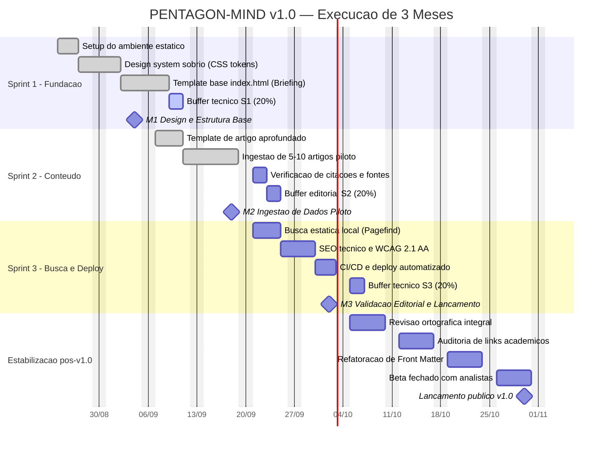

# Cronograma de Entrega — PENTAGON-MIND v1.0

> Plano físico de entrega em 3 sprints de **2 semanas fixas**, com buffer de
> engenharia explícito. Foco em mitigação do risco dominante do projeto: o
> **atraso de conteúdo** (redação e verificação editorial), não o de código.

---

## 1. Linha do Tempo (Gantt)

## 2. Milestones de Entrega Física

| Marco | Data-alvo | Entregável verificável | Critério de aceite |
|---|---|---|---|
| **M1** — Design & Estrutura Base | 2026-09-04 | `css/styles.css` + `index.html` navegável | `node assets/verify.js` → PASSED; contraste AA medido |
| **M2** — Ingestão de Dados Piloto | 2026-09-18 | ≥ 9 briefings em `content/briefings/` | cada um com ≥ 2 fontes primárias e front matter completo |
| **M3** — Validação Editorial & Lançamento | 2026-10-02 | site público em URL de borda | pipeline verde: lint + link-check + deploy |
| **M4** — Lançamento público v1.0 | 2026-10-30 | portal estabilizado | zero links quebrados; revisão de viés concluída |

## 3. Buffer de Engenharia (20%)

Cada sprint de 10 dias úteis reserva **2 dias (20%)** que **não** recebem escopo
de feature no planejamento. Alocação nominal do buffer:

| Destinação | Fração do buffer | Justificativa |
|---|---|---|
| Revisão ortográfica e de estilo (pt-BR) | 35% | densidade técnica eleva a taxa de erro tipográfico |
| Verificação de links de fontes acadêmicas | 30% | relatórios CRS/RAND rotacionam URL e número de série |
| Refatoração de metadados (Front Matter) | 25% | enums da taxonomia amadurecem com o corpus |
| Contingência não alocada | 10% | absorve variância |

**Regra de consumo:** o buffer é consumido do fim da sprint para o começo. Se
mais de 50% do buffer for consumido antes do 8º dia útil, o escopo de conteúdo
da sprint é reduzido — **nunca** a etapa de fact-check.

## 4. Registro de Riscos

| Risco | Prob. | Impacto | Mitigação |
|---|---|---|---|
| Redação de briefing excede a estimativa | Alta | Médio | corpus mínimo de 5 artigos define M2; 6–10 são incrementais |
| Fonte primária torna-se inacessível (link rot) | Média | Alto | registrar título + número de série (ex.: `CRS R47266`), não só URL |
| Divergência de nomenclatura DoD entre fontes | Média | Médio | `editorial-guidelines.md` §2 é a autoridade final |
| Custo de acessibilidade subestimado | Baixa | Médio | auditoria de contraste ocorre na Sprint 1, não na 3 |
| Deriva de tom (viés político) | Média | **Crítico** | revisão de viés é portão de merge, não tarefa de sprint |

## 5. Cadência Operacional

- **Sprint:** 2 semanas fixas, sem prorrogação (escopo cede, data não).
- **Planning:** 1ª segunda-feira da sprint.
- **Revisão editorial:** contínua, por pull request.
- **Review + Retrospectiva:** última sexta-feira da sprint.
- **Definition of Done global:** `verify.js` PASSED + checklist de
  [`quality.md`](quality.md) integralmente marcado + pipeline de CI verde.
