# Plano de Implementação — PENTAGON-MIND
### *(v3 — Corrigido: inconsistências arquiteturais, lacunas técnicas e conformidade)*

Plano de modernização, tipagem estrita, reengenharia de arquitetura e expansão funcional do portal analítico de inteligência militar e geopolítica dos EUA (**PENTAGON-MIND**), migrando de arquivos vanilla estáticos para a mesma stack robusta do projeto de referência: **Next.js 14 (App Router) + TypeScript + Tailwind CSS + Lucide Icons + Vitest + Zod + LGPD**.

> [!NOTE]
> **Resumo das correções aplicadas nesta revisão:**
> 1. Removida inconsistência entre o diagrama (`/api/briefings`) e a seção "Proposed Changes" (que nunca criava esse arquivo).
> 2. Rate limiting redefinido para funcionar em ambiente serverless (store externo, não memória local).
> 3. Verificação de proveniência exigida para as 59 imagens legadas antes da migração.
> 4. Bibliotecas específicas definidas para mapa, gráficos, exportação de PDF e busca (em vez de "reinventar a roda").
> 5. Alternativas textuais/tabulares exigidas para os 3 módulos visuais mais complexos, para viabilizar WCAG 2.1 AA de fato.
> 6. Adicionados: CI/CD, `not-found.tsx`, anti-abuso no formulário, `sitemap.xml`/`robots.txt`, testes E2E dos módulos interativos.
> 7. Nota editorial sobre nível de detalhe dos cenários de wargame e sourcing de conteúdo de terceiros (RAND/CSIS/CRS).

---

## User Review Required

> [!IMPORTANT]
> **Definições de Arquitetura e Engenharia:**
> - **Localização do Projeto:** `C:\Users\Marcelo\Desktop\EUA`.
> - **Stack Principal:** **Next.js 14 (App Router) + TypeScript + Tailwind CSS + Lucide Icons + Vitest + Zod**.
> - **Design System "Command Center":** Fundo tático escuro (`#0e1116` / `#14161a`), bordas em grafite (`#2a2f37`), acentos em azul militar institucional (`#2f7fb5`), âmbar de prontidão (`#c9a227`) e vermelho de ameaça crítica (`#d9534f`).
> - **Acessibilidade Universal:** Padrão **WCAG 2.1 nível AA**, com seletor de tamanho de fonte (`A`, `A+`, `A++`), modo de alto contraste para leitura técnica e navegação 100% por teclado.
>   - **Correção:** para os 3 módulos mais visuais (Mapa Tático, Comparador, JADC2/Wargame), a meta AA só é alcançável com uma **alternativa em texto/tabela equivalente** ao conteúdo visual (WCAG SC 1.1.1/1.4.1) — ver seção 4 dos componentes.
> - **Conformidade Legal & LGPD:** Página dedicada de Política de Privacidade e consentimento explícito no formulário de contato/solicitação de análise.
> - **Bibliotecas definidas (correção — antes não especificadas):**
>   - Mapa interativo: `react-simple-maps` (SVG, sem custo de API, sem chave externa) em vez de Mapbox/Google Maps (evita custo/limite de requisições para um MVP).
>   - Gráficos de orçamento: `recharts`.
>   - Busca ponderada: `Fuse.js` (fuzzy search madura) em vez de mecanismo próprio.
>   - Exportação de dossiê/PDF: `react-to-print` para impressão limpa no MVP (evita a complexidade de gerar PDF server-side com Puppeteer nesta fase).

---

## 🚀 Novas Funcionalidades Avançadas Adicionadas ao MVP

Além da migração completa das 10 páginas originais, foram incorporados **6 novos módulos de inteligência interativa**:

1. **Mapa Tático Interativo de Teatros de Operações (Global Threat Matrix):**
   - Mapa mundi vetorial interativo com marcadores pulsantes de pontos quentes (*Flashpoints*: Estreito de Taiwan, Bálticos/Suwalki, Estreito de Ormuz, Mar Vermelho, Mar do Sul da China, Península Coreana).
   - Nível de prontidão tática (DEFCON / Threat Level), efetivo desdobrado, vetores de ameaça e tratados aplicáveis (ex.: Artigo 5 da OTAN, Tratado Bilateral EUA-Japão).
   - **Correção de acessibilidade:** incluir uma visualização alternativa em tabela (`ThreatMapTable.tsx`) com os mesmos dados, ativável por um botão "Ver como tabela" — necessária para leitores de tela e para o critério AA.

2. **Comparador Tático de Sistemas de Armas (Weapons Systems Comparator):**
   - Ferramenta comparativa lado a lado de plataformas militares (ex.: *F-35A vs F-22A vs NGAD*, ou *Minuteman III vs Columbia SSBN*, ou *LRHW vs Kinzhal/DF-17*).
   - Métricas visuais comparadas: Alcance operacional, Velocidade Mach, Assinatura Stealth (RCS), Custo unitário, Carga útil e Vetor de guiagem.
   - **Nota de conteúdo:** usar apenas especificações já públicas e amplamente divulgadas (fichas técnicas oficiais/imprensa especializada), nunca dados de desempenho operacional não publicados — mantém o módulo estritamente educativo/analítico.

3. **Simulador de Cenários de Crise & Escalada (Crisis Wargame Matrix):**
   - Árvore interativa de tomada de decisão baseada em doutrinas reais (ex.: *"Contingência de Bloqueio Naval no Estreito de Taiwan"*, *"Ataque Cibernético à Constelação SDA/GPS"*, *"Escalada no Golfo Pérsico"*).
   - Mostra o desencadeamento de respostas operacionais: ativação de loops JADC2, escalada de dissuasão nuclear e consultas multilaterais.
   - **Correção editorial:** manter os cenários no nível de doutrina/política pública (o que já está em CRS, RAND, DoD Joint Pubs), sem detalhar planejamento operacional específico (posicionamento de forças, alvos, cronogramas táticos reais) — o objetivo é educativo, não um manual de planejamento.
   - **Correção de acessibilidade:** a árvore de decisão precisa de navegação 100% por teclado com foco visível em cada nó, e um resumo textual linear como alternativa à visualização em árvore.

4. **Visualizador de Fluxo JADC2 (Sensor-to-Shooter Loop):**
   - Diagrama dinâmico e interativo demonstrando a cadeia unificada de comando: **Satélites SDA/Espaço** → **Sensores Aéreos (E-7 / F-35)** → **Nuvem de IA Tática (ABMS / Project Convergence)** → **Atiradores Cinéticos (HIMARS / Typhon / Destróieres Arleigh Burke)**.
   - **Correção de acessibilidade:** legenda textual sequencial obrigatória (`<ol>` semântico) descrevendo o mesmo fluxo, para além do SVG/diagrama.

5. **Analisador Histórico do Orçamento de Defesa (DoD NDAA Spending Trends):**
   - Gráficos (`recharts`) e dados históricos dos orçamentos de defesa dos EUA (1989 a 2026+), distribuição por ramo (Exército, Marinha, Força Aérea, Força Espacial) e principais eixos de P&D (DARPA, Hipersônicos, IA e Autonomia).
   - Cada gráfico deve incluir uma tabela de dados subjacente (`<table>` colapsável) para acessibilidade e para permitir verificação/citação da fonte por linha.

6. **Exportação de Dossiês Analíticos (Modo Dossiê de Impressão / PDF Limpo):**
   - Formatação cirúrgica sem distrações de interface via `react-to-print`, pronta para impressão ou exportação de briefings com cabeçalho de classificação institucional e referências primárias (CRS/RAND/DoD).

7. **Inspetor Universal de Termos do Glossário (Global Acronym Inspector):**
   - Popovers inteligentes em todo o texto do portal onde siglas militares aparecem (`JADC2`, `A2/AD`, `C4ISR`, `MDO`, `ICBM`, `SSBN`, `RMA`, `GPC`), exibindo glosa instantânea em português sem sair da leitura.
   - Popovers devem ser acessíveis via teclado (`Tab` para focar o termo, `Enter`/`Space` para abrir, `Esc` para fechar) — sem isso o módulo quebra a meta AA.

---

## Arquitetura Geral do Portal (Next.js App Router)

```mermaid
graph TD
    App[PENTAGON-MIND v3 - Next.js] --> Layout[Root Layout: Topbar Tatica, Acessibilidade e SEO OpenGraph]
    
    Layout --> Dashboard[1. Home / Painel Executivo e Alerta Estrategico]
    Layout --> ThreatMap[2. Mapa Tatico Interativo de Ameacas Globais]
    Layout --> Doutrina[3. Doutrina Militar e Matriz Comparativa]
    Layout --> Arsenal[4. Arsenal e Fichas de Armamentos]
    Layout --> Comparator[5. Comparador Tatico de Sistemas de Armas]
    Layout --> Dominios[6. Dominios Estrategicos e Fluxos JADC2]
    Layout --> Wargame[7. Simulador de Crises e Escalada Doutrinaria]
    Layout --> Geopolitica[8. Estudos de Caso e Contingencias Regionais]
    Layout --> Budget[9. Analisador do Orcamento de Defesa - NDAA]
    Layout --> Presidentes[10. Matriz Estrategica Presidencial 1989-2026+]
    Layout --> OTAN[11. OTAN, Artigo 5 e Aliancas do Indo-Pacifico]
    Layout --> Briefings[12. Hub de Briefings e Dossies Analiticos]
    Layout --> Glossario[13. Glossario Militar com Popovers e Busca]
    Layout --> Busca[14. Busca Global Multifacetada com Debounce]
    Layout --> Contato[15. Solicitacao de Analise / Contato]
    Layout --> LGPD[16. Politica de Privacidade]

    Contato --> APIContact[/api/contact: Zod, Rate Limiting externo e LGPD/]
```

> [!NOTE]
> **Correção:** o nó `APIBriefings (/api/briefings)` da v2 foi **removido do diagrama**. Os briefings são dados estáticos (`briefings.ts`), resolvidos em build-time via `generateStaticParams` nas rotas `[slug]` — não há necessidade de uma API route para isso. Se no futuro os briefings passarem a ser editáveis via CMS, essa API volta a fazer sentido e deve ser reintroduzida nos dois lugares (diagrama e "Proposed Changes") de forma consistente.

---

## Proposed Changes

### 1. Fundação, Configurações e Testes

#### [NEW] `package.json`, `next.config.mjs`, `tailwind.config.js`, `tsconfig.json`, `vitest.config.ts`, `playwright.config.ts` *(adicionado)*
- Inicialização do ambiente Next.js 14, TypeScript estrito, Tailwind CSS, Lucide React, Zod, Vitest e **Playwright** (testes E2E dos módulos interativos).
- Preservação da biblioteca local de 59 imagens em `public/assets/img/`, **condicionada a uma auditoria prévia de proveniência** (ver seção "Correção Legal" abaixo).
- `.env.example`, `.gitignore`, `README.md` com setup.
- `robots.txt` e `sitemap.xml` gerados via `next-sitemap` — essencial dado o volume de conteúdo (16 rotas + briefings dinâmicos).

#### ⚠️ Correção Legal — Proveniência das Imagens
As 59 imagens herdadas do site vanilla **não têm origem documentada** neste plano. Antes da migração:
- Fotos produzidas por órgãos do governo federal dos EUA (DoD, exército, etc.) são domínio público nos EUA (17 U.S.C. §105) e podem ser usadas livremente.
- Fotos de agências de imprensa (Reuters, AP, Getty) ou de fabricantes (Lockheed Martin, Boeing) **não são domínio público** e exigem licença.
- Ação recomendada: criar `public/assets/img/SOURCES.md` catalogando fonte e licença de cada imagem antes de publicá-las no novo portal. Imagens sem fonte confirmada devem ser substituídas por material CC0/domínio público equivalente (ex.: DVIDS — Defense Visual Information Distribution Service, que é a fonte oficial e catalogada de fotos públicas do DoD).

---

### 2. Camada de Dados, Ontologia e Tipagens (`src/types/` e `src/data/`)

#### [NEW] `src/types/index.ts`
- Tipagens estritas: `Administration`, `Doctrine`, `Conflict`, `WeaponSystem`, `Briefing`, `GlossaryTerm`, `GeopoliticalCase`, `FlashpointThreat`, `WargameScenario`, `BudgetYear`, `ContactFormData`.

#### [NEW] `src/data/ontology.ts`
- Base relacional completa com administrações (Bush 41 a Trump 2 - 2026+), 8 doutrinas militares, 11 conflitos e cruzamento de sistemas de armas.
- **Correção:** cada entrada deve incluir campo `source` (URL ou referência) e `lastVerified` (data), já que o corpus mistura fatos históricos com dados recentes/em andamento — sem isso não há como verificar ou atualizar a precisão do conteúdo depois.

#### [NEW] `src/data/arsenal.ts`
- Especificações técnicas de 20+ sistemas de armas para catálogo e comparador tático, com o mesmo campo `source` obrigatório por item.

#### [NEW] `src/data/threatMap.ts`
- Dados dos 7 principais teatros de operações globais, coordenadas relativas, nível de prontidão e forças alocadas.

#### [NEW] `src/data/wargame.ts`
- 3 cenários detalhados de crise com ramificações estratégicas e gatilhos doutrinários, mantidos em nível de doutrina pública (ver nota editorial do módulo 3 acima).

#### [NEW] `src/data/budget.ts`
- Série histórica do orçamento de defesa (DoD/NDAA), repartição por ramo e investimentos em P&D de ponta, com fonte primária citada por ano (ex.: relatórios do CRS).

#### [NEW] `src/data/briefings.ts` & `src/data/glossary.ts`
- Briefings analíticos com fontes primárias estáveis (CRS, RAND, CSIS, DoD Joint Pubs) e glossário EN → pt-BR.
- **Correção de direitos autorais:** briefings devem ser **resumos/paráfrases próprias** do conteúdo das fontes primárias, com link de referência — nunca reprodução extensa do texto original de relatórios da RAND/CSIS/CRS.

#### [NEW] `src/lib/schemas.ts` *(adicionado)*
- Schemas Zod para os próprios arquivos de dados (`ontology.ts`, `arsenal.ts`, etc.), validados em tempo de build/CI — garante que erros de digitação ou campos ausentes nos dados quebrem o build em vez de chegar em produção.

---

### 3. Utilitários e Testes Automatizados (`src/lib/`)

#### [NEW] `src/lib/validations.ts` & `src/lib/validations.test.ts`
- Validação Zod do formulário de contato e consentimento LGPD.

#### [NEW] `src/lib/search.ts` & `src/lib/search.test.ts`
- Busca com **Fuse.js** (correção: biblioteca madura em vez de mecanismo próprio) com filtros facetados por vetor militar, região e período.

#### [NEW] `src/lib/comparator.ts` & `src/lib/comparator.test.ts`
- Lógica de cálculo comparativo e normalização de métricas de armamentos.

#### [NEW] `src/lib/ontology.test.ts`
- Testes unitários para validar a integridade referencial dos dados cruzados.

#### [NEW] `src/lib/rateLimit.ts` *(corrigido)*
- Rate limiting via **Upstash Redis** (ou equivalente compatível com edge/serverless) em vez de contagem em memória — memória local não é compartilhada entre instâncias serverless da Vercel e não protegeria o endpoint de fato.

---

### 4. Componentes Base e Layout (`src/components/`)

#### [NEW] `src/components/ui/`
- `Badge.tsx`, `Button.tsx`, `Card.tsx`, `Input.tsx`, `Modal.tsx`, `Toast.tsx`, `DatasheetAccordion.tsx`, `GlossaryInspector.tsx`, `DataTable.tsx` *(adicionado — usado como fallback acessível pelos módulos visuais)*.

#### [NEW] `src/components/layout/Navbar.tsx` & `Footer.tsx`
- Barra de comando com indicador de prontidão de alerta, atalhos de navegação, seletor de acessibilidade (`A`, `A+`, `A++`) e modo alto contraste.
- Rodapé institucional com avisos de fontes públicas e link para a LGPD.

#### [NEW] `src/components/features/`
- `ThreatMapViewer.tsx` (`react-simple-maps`) + `ThreatMapTable.tsx` (alternativa acessível).
- `WeaponsComparator.tsx`: seletor duplo e matriz comparativa com barras visuais + versão em tabela simples.
- `WargameSimulator.tsx`: árvore de decisão navegável por teclado + resumo textual linear.
- `JADC2FlowDiagram.tsx`: diagrama SVG + lista ordenada (`<ol>`) equivalente.
- `BudgetChart.tsx` (`recharts`) + tabela de dados subjacente colapsável.
- `BriefingPrintDossier.tsx` (`react-to-print`): visualização de dossiê limpo para impressão.

#### [NEW] `src/app/not-found.tsx` e `src/app/briefings/[slug]/not-found.tsx` *(adicionado)*
- Páginas de erro 404 personalizadas — sem isso, um slug de briefing inválido gera a página de erro genérica do Next.js, quebrando a identidade visual "Command Center".

#### [NEW] `src/components/contact/ContactForm.tsx`
- Formulário com validação Zod + **honeypot field ou reCAPTCHA v3** *(adicionado)* — um formulário público em um site de temática militar/geopolítica é alvo previsível de spam e bots; isso não estava coberto no plano original.

---

### 5. Páginas e Rotas do Sistema (`src/app/`)

#### [NEW] `src/app/page.tsx` — Dashboard Executivo & Alerta Global
#### [NEW] `src/app/mapa-tatico/page.tsx` — Mapa Tático Interativo de Ameaças
#### [NEW] `src/app/doutrina/page.tsx` — Doutrina Militar & Matriz Comparativa
#### [NEW] `src/app/arsenal-tecnologia/page.tsx` — Arsenal Tecnológico & Fichas
#### [NEW] `src/app/comparador/page.tsx` — Comparador Tático de Armamentos
#### [NEW] `src/app/dominios-estrategicos/page.tsx` — Domínios & Fluxo JADC2
#### [NEW] `src/app/simulador-crise/page.tsx` — Simulador de Crise & Wargame
#### [NEW] `src/app/impactos-geopoliticos/page.tsx` — Estudos de Caso Regionais
#### [NEW] `src/app/orcamento-defesa/page.tsx` — Análise Orçamentária NDAA
#### [NEW] `src/app/politicas-presidenciais/page.tsx` — Matriz Presidencial 1989–2026+
#### [NEW] `src/app/otan/page.tsx` — OTAN & Alianças do Indo-Pacífico
#### [NEW] `src/app/briefings/page.tsx` & `src/app/briefings/[slug]/page.tsx` — Hub de Briefings (dados estáticos, sem API — ver correção da seção de arquitetura)
#### [NEW] `src/app/glossario/page.tsx` — Glossário Militar com Busca
#### [NEW] `src/app/busca/page.tsx` — Centro de Busca Global
#### [NEW] `src/app/contato/page.tsx` & `src/app/api/contact/route.ts` — Contato & API com LGPD, rate limiting externo e anti-spam
#### [NEW] `src/app/politica-de-privacidade/page.tsx` — Política de Privacidade (LGPD)

---

## Verification Plan

### Testes Automatizados (Vitest)
1. **Integridade de Dados:** Validar todos os vínculos relacionais da ontologia (`ontology.test.ts`) e os schemas Zod dos arquivos de dados (`schemas.ts`).
2. **Mecanismo de Busca:** Validar pontuação e filtros facetados via Fuse.js (`search.test.ts`).
3. **Comparador Tático:** Validar cálculos e métricas comparativas (`comparator.test.ts`).
4. **Validações Zod:** Validar formulário de solicitação e exigência de consentimento LGPD (`validations.test.ts`).
5. **Build de Produção:** Executar `npm run build` garantindo zero erros de tipagem e geração estática (SSG) das rotas de conteúdo.

### Testes E2E — Playwright *(adicionado, ausente na v2)*
1. Navegação completa pelo Mapa Tático (abrir marcador, alternar para visualização em tabela).
2. Fluxo do Comparador de Armamentos (selecionar 2 sistemas, verificar métricas exibidas).
3. Navegação por teclado completa no Simulador de Wargame (sem uso de mouse).
4. Envio do formulário de contato, incluindo tentativa de bypass do honeypot/anti-spam.

### Testes Manuais & Funcionais
1. **Responsividade Mobile-First:** Validar layout em resoluções mobile (375px), tablet (768px) e desktop (1440px).
2. **Acessibilidade:** Validar aumento de fonte, alto contraste, navegação por teclado (Tab/Enter/Esc nos popovers e modais) e as alternativas textuais/tabulares dos 3 módulos visuais mais complexos.
3. **Módulos Interativos:** Testar o Mapa Tático, o Comparador de Armamentos, o Simulador de Crise e o Diagrama JADC2.
4. **Submissão de Formulário:** Testar envio na rota `/api/contact` com rate limiting real (múltiplas requisições sequenciais) e confirmação visual toast.
5. **Auditoria de Fontes:** Amostragem de 10 itens de `ontology.ts`, `arsenal.ts` e `budget.ts` para confirmar que os campos `source`/`lastVerified` apontam para referências reais e verificáveis.

### CI/CD *(adicionado)*
- GitHub Actions rodando `lint`, `test` (Vitest), `test:e2e` (Playwright) e `build` em cada Pull Request antes de permitir merge/deploy.
- Deploy contínuo via Vercel, com variáveis de ambiente (Upstash, reCAPTCHA) configuradas no painel do provedor.
